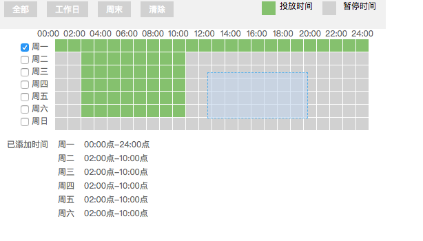

# vue分小时选择插件


## 安装

```base
npm install hour-selecter --save
```

```js
import hourSelect from 'hour-selecter'
Vue.use(hourSelect)
```

## 使用
```html
 <hour-select></hour-select>
```

## props

|Prop|Type|Default| Description|
|:---|:---|:------|:-----------|
|isEditable|Boolean| true|是否可以编辑|
|timeval|String| 168位字符串|回填参数|

## Event
|Event|Output| Description |
|:----|:-----|:------------|
|res-change|String|已选择的小时  |

## Result
 

